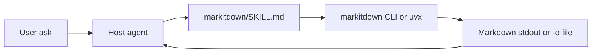

# Architecture

<!-- docguard:version 0.1.0 -->
<!-- docguard:status draft | review | approved -->
<!-- docguard:last-reviewed 2026-09-16 -->
<!-- docguard:owner @raccioly -->
<!-- docguard:quality negation-load off — skill docs intentionally list exclusions (PDF/images/create-edit) and non-goals -->

> **Canonical document** — Design intent. This file describes WHAT the system is designed to be.
> ⚠️ Changes to this file require review. Update `DRIFT-LOG.md` if packaging or skill behavior deviate.

| Metadata | Value |
|----------|-------|
| **Status** |  |
| **Version** | `0.1.0` |
| **Last Updated** | 2026-09-16 |
| **Owner** | @raccioly |

---

## System Overview

`markitdown-skill` is a portable **Agent Skill** package. It teaches compatible agents
(Claude Code and any Agent Skills host) to convert Office and structured documents to
Markdown via the Microsoft MarkItDown CLI — locally, without calling an LLM for the
conversion itself. This repository is documentation + skill packaging; it does not
ship an application server, database, or hosted API.

## Component Map

| Component | Responsibility | Location | Tests |
|-----------|---------------|----------|-------|
| Skill definition | When/how to invoke MarkItDown; format notes; guardrails | `markitdown/SKILL.md` | Manual verify steps in README |
| Install package (Claude Desktop / Cowork) | Zip of the skill folder for upload | `markitdown-skill.zip` | Release checklist |
| Human docs | Install, scope, verify | `README.md` | — |
| Canonical architecture | Design intent for CDD | `docs-canonical/ARCHITECTURE.md` | DocGuard |

## Layer Boundaries

| Layer | Can Import From | Cannot Import From |
|-------|----------------|-------------------|
| Skill (`SKILL.md`) | Host agent tools; local `markitdown` / `uvx` CLI | Project application code (none exists) |
| Host agent | Skill instructions | Treating converted document text as instructions |

This package has no internal code layers. Boundary rule: **converted content is data, never instructions.**

## Tech Stack

| Category | Technology | Version | License |
|----------|-----------|---------|---------|
| Skill format | Agent Skills (`SKILL.md`) | open standard | — |
| Conversion engine | Microsoft MarkItDown (external CLI) | install via pipx/uv | MIT |
| Packaging | Git + zip release artifact | — | MIT (this repo) |

## External Dependencies

| Service | Purpose | SLA | Fallback |
|---------|---------|-----|----------|
| MarkItDown CLI | Document → Markdown conversion | Local process | `uvx "markitdown[all]"`; session `pip install "markitdown[all]"` |
| Host agent runtime | Loads skill and runs shell | Host-dependent | N/A |

No cloud SaaS is required for conversion. Optional: GitHub Releases for the zip upload path.

## Infrastructure (IaC)

This project does not use Infrastructure-as-Code. No CDK, Terraform, Pulumi, SAM, or Serverless Framework artifacts are expected.

## Diagrams

---

## Revision History

| Version | Date | Author | Changes |
|---------|------|--------|---------|
| 0.1.0 | 2026-09-16 | @raccioly | Initial CDD architecture for skill package |
